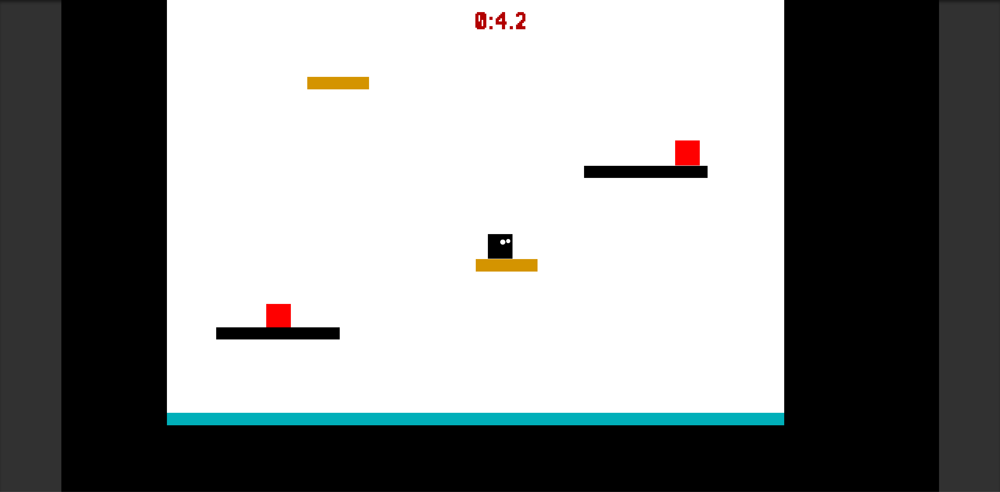

# JumpBox

JumpBox is an arcade jumping game.
Players try to make their way to 
the top by jumping through platforms. If a player touches the red 
platforms, it's game over, and the player has to restart from the 
beginning.

Made with Unity 2018.

# Controls and Mechanics

-A and D keys to move left and right

-Spacebar to jump

-Double jump: Player can double jump by double-tapping the spacebar

-Wall slide: Players can slide through the wall by pressing the A and D keys alternately.

# Screenshots

